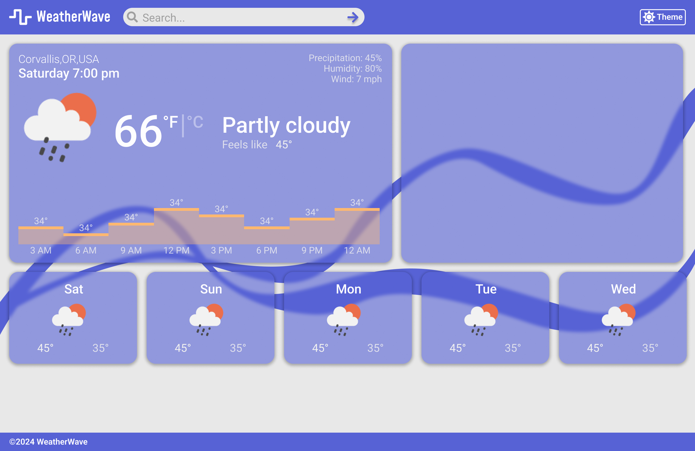
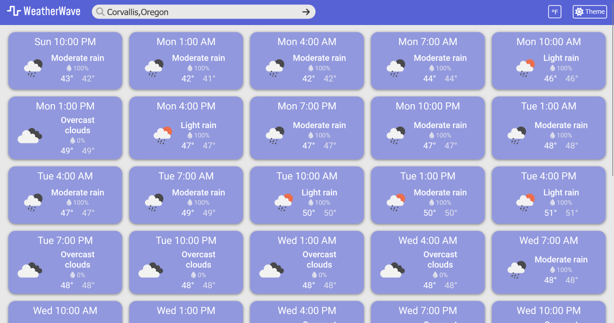

# WeatherWave
A basic weather app built with React and using OpenWeather's free weather [API](https://openweathermap.org/forecast5).

## Project Status
The project currently remains unfinished for now as I want to add a few more features to enhance usability.

TODOs:
- !! Update node packages (seems like there may be vulns)
- Improve UI by showing an error of city not found, and also some city selector
- Separate cards more by day to show discontinuity
- Map
- Current weather card + temperature over time visualization
- Detect system theme of user and/or remember theme last used

## Project Screenshots
I started this project with a vision in Figma (first photo) and the other photo is the current state.

## Installation and Setup Instructions
You will need [node](https://nodejs.org/en) to build the project.
You will also need a free API key from [OpenWeather](https://openweathermap.org/appid).
1. Clone the repository.
2. Install node packages: `npm install`
3. Replace `REPLACEME` in the `.env` file with your key, or make a `.env.local` and add your key there ([this keeps it out of the git history if you make commits](https://vite.dev/guide/env-and-mode)).
4. Run the app in developer mode (enables website to re-load): `npm run dev`
5. A link like http://localhost:5173/ should appear in the terminal to view the site.

## Reflection
I first did this project as a school assignment for advanced web development, though I plan on coming back to it to add more features.
It was my first real brush with using APIs so learning how to call the API and work with the returned data was a good learning experience.
I also learned to style components within the same file (no `.css` file).
It was awesome being able to fully modularize each component and then use emotion's theme feature to create a consistent color theme.

Something I found challenging was implementing a dark mode, the code felt messy once I finished though it works.
In the future, I would like to add some logic to detect what theme the user's system is and make that the default.
I liked that I first drafted my design on paper then Figma as it made implementing the website a lot easier knowing where exactly I was headed.

For iterating on this project, I would like to focus on improving its usability
(e.g., organize temperatures between days, adding a temperature visualization).
